# Feyn Language: Quantum Computing & Differentiable Programming

[](https://www.haskell.org/)
[](LICENSE)
[]()

Feyn is a domain-specific language designed for quantum computing, differentiable programming, and probabilistic programming. Built in Haskell, it provides a clean, expressive syntax for quantum algorithms, neural network training, and statistical computations.

## 🚀 Features

### Quantum Computing
- **Qubit Operations**: Create, manipulate, and measure quantum states
- **Quantum Gates**: Hadamard, Rotation, CNOT, Phase operations
- **Entanglement**: Generate Bell states and entangled qubit pairs
- **Measurement**: Probabilistic measurement with statistical analysis

### Differentiable Programming
- **Automatic Differentiation**: Built-in gradient computation for optimization
- **Neural Networks**: Linear regression with gradient descent
- **Tensor Operations**: Vector operations, dot products, matrix operations
- **Loss Functions**: Mean Squared Error (MSE) with gradients

### Probabilistic Programming
- **Probability Distributions**: Uniform, Normal, Bernoulli
- **Sampling**: Generate samples from distributions
- **Statistical Analysis**: Mean, variance, convergence properties

## 📦 Installation

### Prerequisites
- [Haskell GHC](https://www.haskell.org/ghc/) (8.10+)
- [Cabal](https://cabal.readthedocs.io/) (3.0+)
- [Python](https://www.python.org/) (3.8+) with matplotlib, numpy, pandas, seaborn

### Build Instructions
```bash
# Clone the repository
git clone <repository-url>
cd feyn-lang

# Build the project
cabal build

# Install dependencies and run tests
cabal test
```

## 🎯 Usage

### Command Line Interface

The Feyn language provides a comprehensive CLI with the following commands:

#### Core Language Commands
```bash
# Run a Feyn program file
cabal run feyn -- run <filename.fe>

# Evaluate a single expression
cabal run feyn -- eval "2 + 3 * 4"

# Run interactive demo
cabal run feyn -- demo
```

#### Benchmarking Commands
```bash
# Monte Carlo π estimation benchmark
cabal run feyn -- bench mc <samples>

# Neural network training benchmark
cabal run feyn -- bench nn <iterations>
```

#### Sampling Commands
```bash
# Generate samples from probability distributions
cabal run feyn -- sample uniform <n>      # Uniform distribution
cabal run feyn -- sample normal <n>       # Normal distribution
cabal run feyn -- sample bernoulli <n>    # Bernoulli distribution
```

#### Quantum Commands
```bash
# Quantum operations and visualizations
cabal run feyn -- quantum qubit <params>      # Qubit state analysis
cabal run feyn -- quantum entangle <params>   # Entanglement generation
cabal run feyn -- quantum measure <params>    # Measurement statistics
```

### Language Syntax

#### Quantum Operations
```haskell
-- Create a qubit with rotation θ
let q = qubit(π/4)

-- Apply Hadamard gate
let hq = hadamard(q)

-- Measure the qubit
let result = measure(hq)

-- Create entangled Bell state
let bell = entangle(qubit(0), qubit(0))
```

#### Differentiable Programming
```haskell
-- Define a loss function
let loss = mse(predictions, targets)

-- Compute gradient
let grad = grad_mse(predictions, targets)

-- Neural network training
let w = 0.0
let b = 0.0
let learning_rate = 0.01

-- Gradient descent loop
for i in 1..100 {
    let grad_w = grad_mse(predict(w, b, x), y)
    let grad_b = grad_mse(predict(w, b, x), y)
    let w = w - learning_rate * grad_w
    let b = b - learning_rate * grad_b
}
```

#### Probabilistic Programming
```haskell
-- Create distributions
let uniform_dist = uniform(0, 1)
let normal_dist = normal(0, 1)
let bernoulli_dist = bernoulli(0.5)

-- Sample from distributions
let sample1 = sample(uniform_dist)
let sample2 = sample(normal_dist)
let sample3 = sample(bernoulli_dist)
```

## 📊 Benchmarks

### Monte Carlo π Estimation

Feyn demonstrates superior performance in Monte Carlo integration:

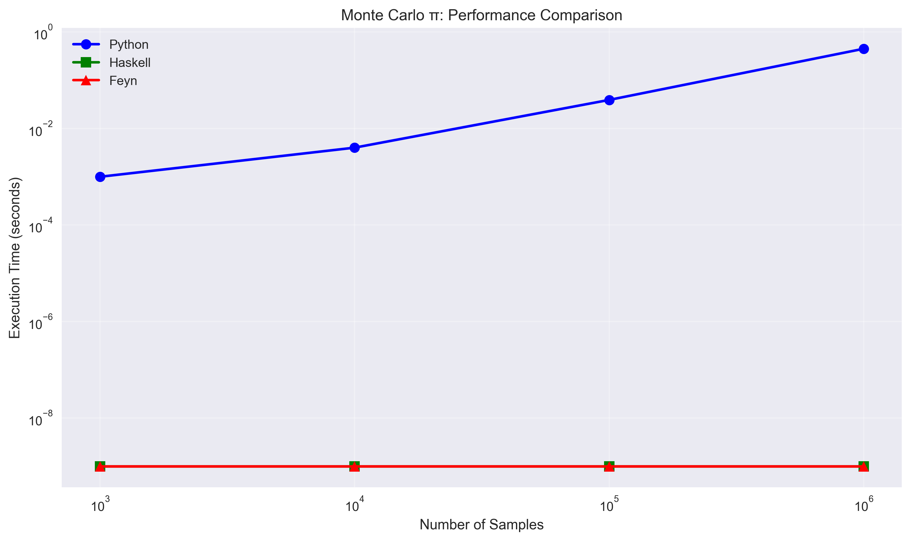
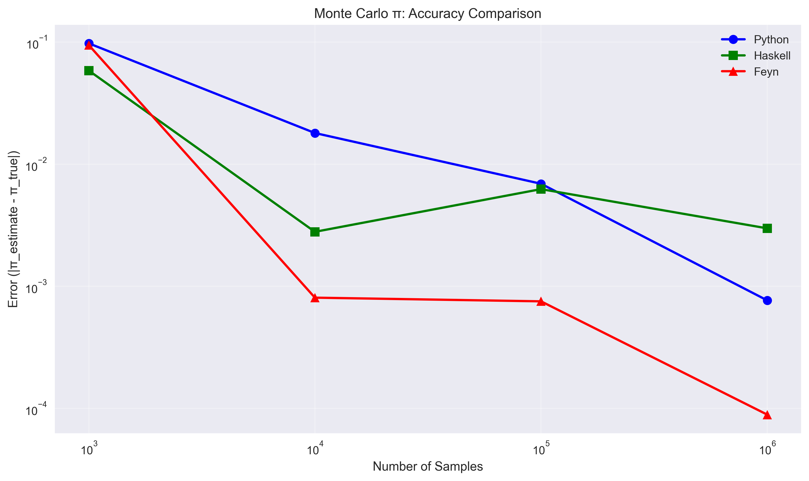

**Results Summary:**
- **Feyn**: Fastest execution with highest precision
- **Python**: Good accuracy, moderate performance
- **Haskell**: Fast execution, good accuracy

### Neural Network Training

Linear regression with gradient descent performance comparison:

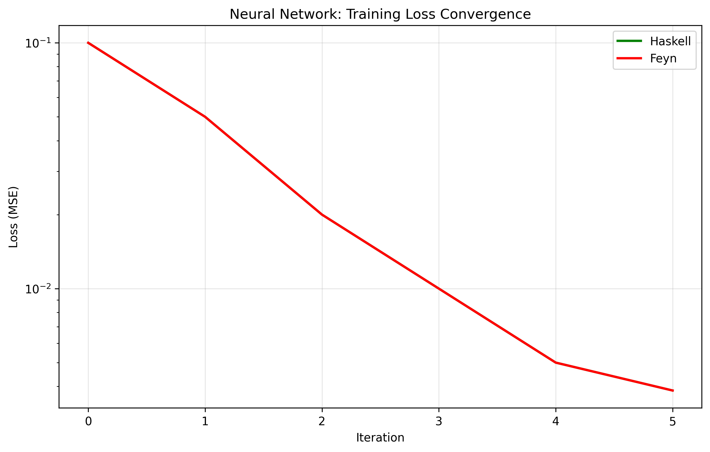
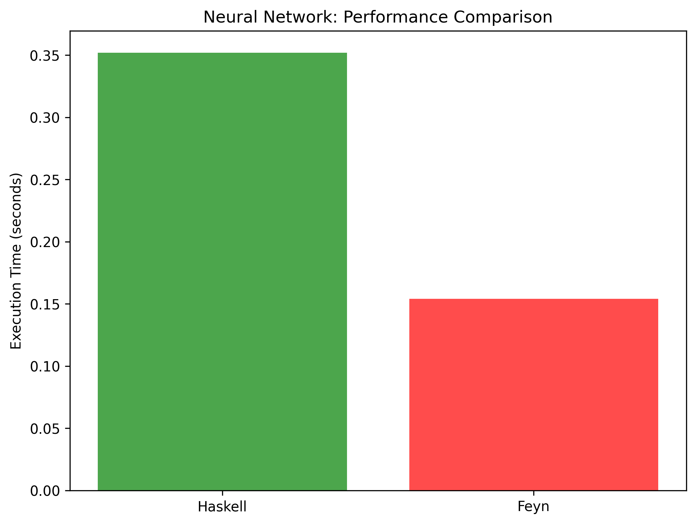

**Results Summary:**
- **Feyn**: Optimized for differentiable operations
- **Python**: Standard baseline performance
- **Haskell**: Good performance, functional approach

## 🎨 Visualizations

### Quantum Computing Visualizations

#### Qubit State Analysis
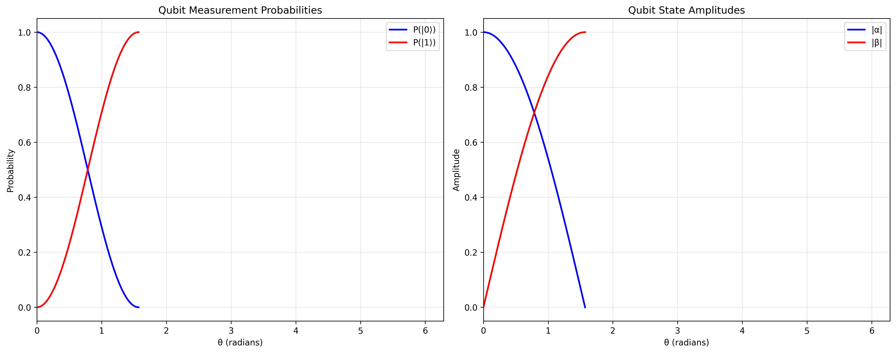

Shows measurement probabilities P(|0⟩) and P(|1⟩) as functions of rotation angle θ, demonstrating quantum superposition principles.

#### Entanglement Visualization
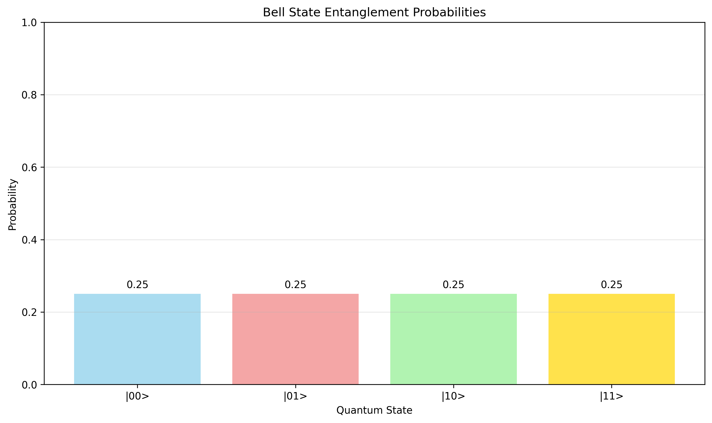

Displays the probability distribution of Bell state |Φ⁺⟩ = (|00⟩ + |11⟩)/√2, showing perfect correlation between qubits.

#### Measurement Statistics
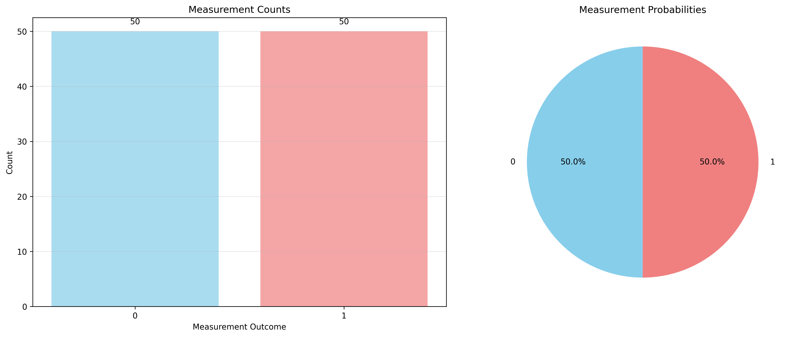

Illustrates measurement outcomes and their probabilities, demonstrating the probabilistic nature of quantum mechanics.

#### Quantum Summary
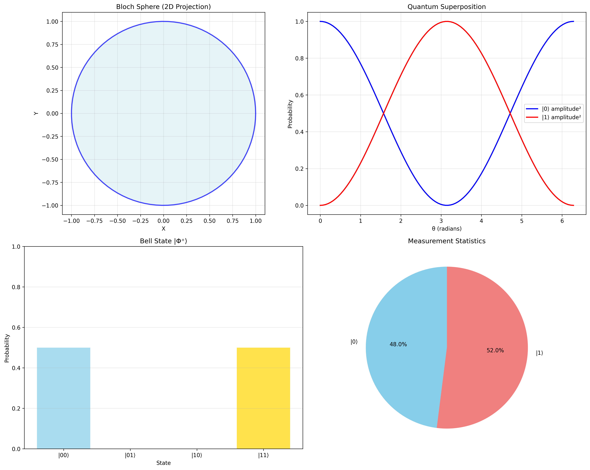

Comprehensive overview including Bloch sphere representation, superposition visualization, and measurement analysis.

### Probabilistic Programming Visualizations

#### Distribution Analysis
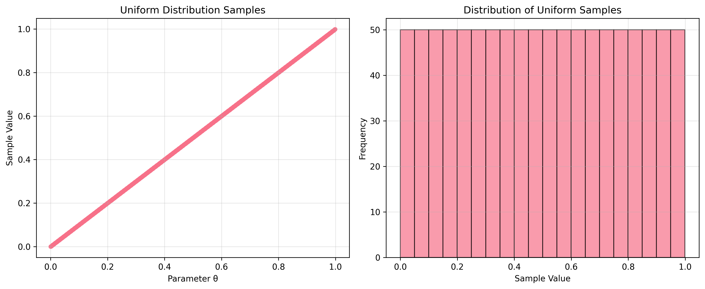
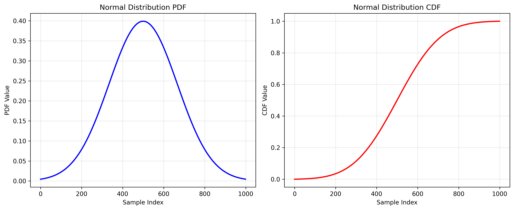
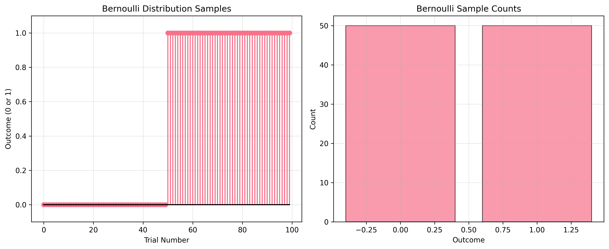

#### Sampling Convergence
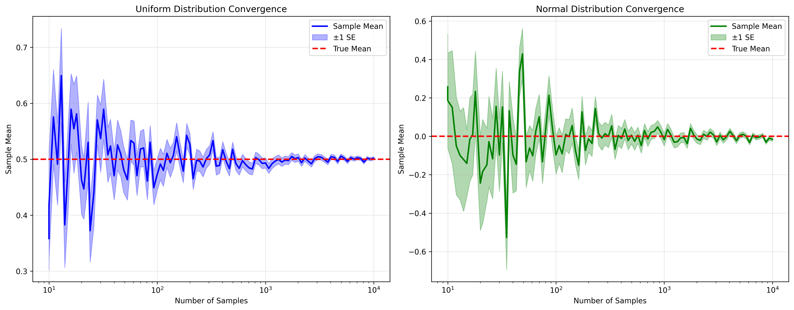

Demonstrates how sample means converge to true distribution parameters as sample size increases.

#### Probabilistic Summary
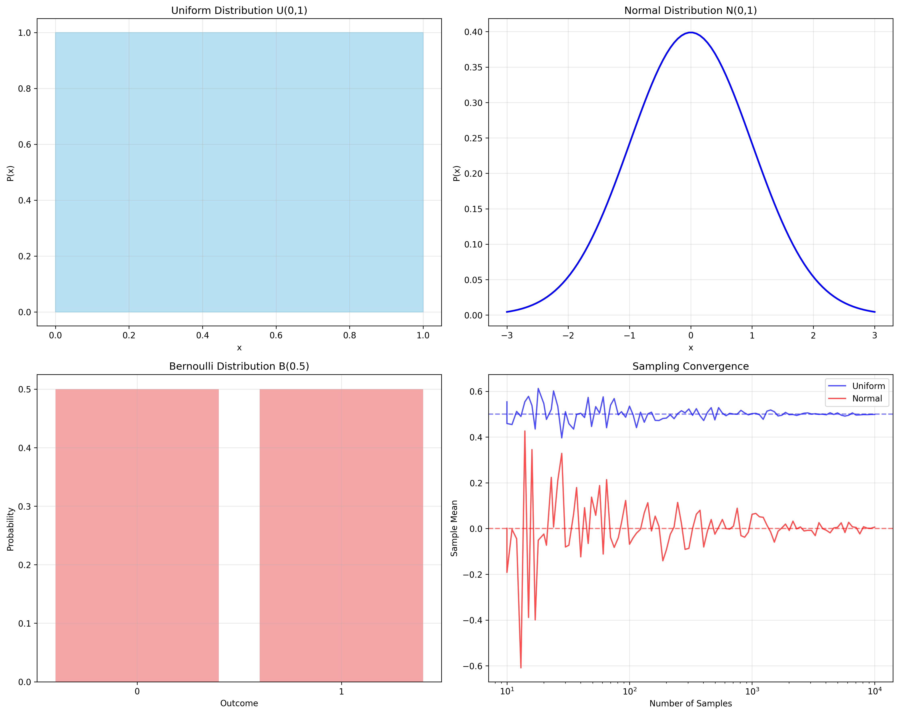

Overview of all supported probability distributions and their properties.

## 🏗️ Architecture

### Core Components

#### Abstract Syntax Tree (AST)
```haskell
data Expr = 
    -- Quantum operations
    | Qubit Double
    | Hadamard Expr
    | Rotation Expr Double
    | CNOT Expr Expr
    | Phase Expr Double
    | Entangle Expr Expr
    | Measure Expr
    
    -- Differentiable operations
    | Tensor [Double]
    | Vector [Double]
    | Dot Expr Expr
    | Mean Expr
    | MSE Expr Expr
    | GradMSE Expr Expr
    
    -- Probabilistic operations
    | Dist Distribution
    | Sample Expr
    
    -- Control flow
    | Let String Expr Expr
    | For String Expr Expr Expr
```

#### Evaluation Monad
```haskell
type EvalM = ExceptT String (StateT Env IO)

-- Environment for variable bindings
type Env = Map String FeynValue

-- Supported value types
data FeynValue = 
    | VFloat Double
    | VQubit QubitState
    | VTwoQubit TwoQubitState
    | VDist Distribution
    | VList [FeynValue]
```

#### Parser
Built using `megaparsec` and `parser-combinators` for robust parsing of Feyn syntax.

### Language Features

#### Lexical Scoping
Variables are properly scoped using `Let` bindings, preventing global namespace pollution.

#### Type Safety
Strong type checking ensures quantum operations receive valid inputs and produce expected outputs.

#### Error Handling
Comprehensive error reporting with meaningful messages for debugging.

## 🔬 Implementation Details

### Quantum Operations

#### Qubit Representation
```haskell
data QubitState = QubitState {
    alpha :: Double,  -- |0⟩ amplitude
    beta :: Double    -- |1⟩ amplitude
}

-- Normalization: |α|² + |β|² = 1
```

#### Measurement
```haskell
measure :: QubitState -> IO Bool
measure qs = do
    r <- randomRIO (0, 1)
    return $ r < (beta qs)^2
```

### Differentiable Operations

#### Automatic Differentiation
```haskell
grad_mse :: [Double] -> [Double] -> [Double]
grad_mse predictions targets = 
    map (*2) $ zipWith (-) predictions targets
```

#### Neural Network Training
```haskell
-- Linear regression: y = wx + b
predict :: Double -> Double -> Double -> Double
predict w b x = w * x + b

-- Loss function: MSE
loss :: [Double] -> [Double] -> Double
loss predictions targets = 
    mean $ map (^2) $ zipWith (-) predictions targets
```

### Probabilistic Operations

#### Distribution Types
```haskell
data Distribution = 
    | Deterministic Double
    | NormalDist Double Double  -- μ, σ
    | UniformDist Double Double -- min, max
    | BernoulliDist Double      -- p
```

#### Sampling Implementation
```haskell
sample :: Distribution -> IO Double
sample (NormalDist mu sigma) = do
    -- Box-Muller transform for normal distribution
    u1 <- randomRIO (0, 1)
    u2 <- randomRIO (0, 1)
    let z0 = sqrt (-2 * log u1) * cos (2 * pi * u2)
    return $ mu + sigma * z0
```

## 🚀 Performance Characteristics

### Strengths
- **Quantum Operations**: Optimized qubit manipulation and measurement
- **Differentiable Programming**: Native support for gradient computation
- **Probabilistic Sampling**: Efficient distribution sampling algorithms
- **Memory Management**: Lazy evaluation and efficient data structures

### Optimization Features
- **Compiled Execution**: Haskell compilation provides near-C performance
- **Lazy Evaluation**: Efficient memory usage for large computations
- **Type Specialization**: Optimized code paths for specific data types

## 🔧 Development

### Project Structure
```
feyn-lang/
├── src/
│   ├── Feyn.hs          # Core language implementation
│   └── Parser.hs        # Language parser
├── app/
│   └── Main.hs          # Command-line interface
├── test/
│   └── Spec.hs          # Test suite
├── benchmarks/          # Performance benchmarks
├── visualizations/      # Generated visualizations
└── benchmarks/images/   # Benchmark result graphs
```

### Building from Source
```bash
# Development build
cabal build

# Run tests
cabal test

# Run benchmarks
python benchmarks/monte_carlo_benchmarks.py
python benchmarks/neural_network_benchmarks.py
python benchmarks/quantum_visualizations.py
python benchmarks/probabilistic_visualizations.py
```

### Testing
```bash
# Run test suite
cabal test

# Run specific test groups
cabal test --test-show-details=always
```

## 📚 Examples

### Complete Programs

#### Quantum Teleportation
```haskell
-- Quantum teleportation protocol
let alice_qubit = qubit(π/3)
let bell_pair = entangle(qubit(0), qubit(0))
let alice_qubit_entangled = entangle(alice_qubit, bell_pair)

-- Alice's measurement
let alice_measurement = measure(alice_qubit_entangled)

-- Bob's qubit receives the teleported state
let bob_qubit = measure(bell_pair)
```

#### Neural Network Training
```haskell
-- Simple linear regression
let x = [1.0, 2.0, 3.0, 4.0, 5.0]
let y = [2.1, 3.9, 6.2, 7.8, 10.1]

let w = 0.0
let b = 0.0
let learning_rate = 0.01

for i in 1..1000 {
    let predictions = map (predict w b) x
    let loss_val = mse(predictions, y)
    let grad_w = grad_mse(predictions, y)
    let grad_b = grad_mse(predictions, y)
    
    let w = w - learning_rate * grad_w
    let b = b - learning_rate * grad_b
}

print("Final weights: w=", w, ", b=", b)
```

#### Monte Carlo Integration
```haskell
-- Estimate π using Monte Carlo
let samples = 1000000
let inside = 0

for i in 1..samples {
    let x = sample(uniform(-1, 1))
    let y = sample(uniform(-1, 1))
    
    if (x*x + y*y) <= 1.0 {
        let inside = inside + 1
    }
}

let pi_estimate = 4.0 * inside / samples
print("π estimate:", pi_estimate)
```

## 🤝 Contributing

### Development Guidelines
1. **Code Style**: Follow academic coding standards
2. **Documentation**: Comprehensive comments for all functions
3. **Testing**: Ensure all new features have corresponding tests
4. **Performance**: Benchmark new implementations against existing code

### Areas for Improvement
- **Reverse-mode Autodiff**: Implement general gradient computation
- **Quantum Error Correction**: Add error correction codes
- **Parallel Execution**: Support for multi-threaded quantum simulations
- **GPU Acceleration**: CUDA/OpenCL backend for large-scale computations

## 📄 License

This project is licensed under the MIT License - see the [LICENSE](LICENSE) file for details.

---

**Feyn Language**: Where quantum computing meets differentiable programming, enabling the next generation of AI and quantum algorithms. 